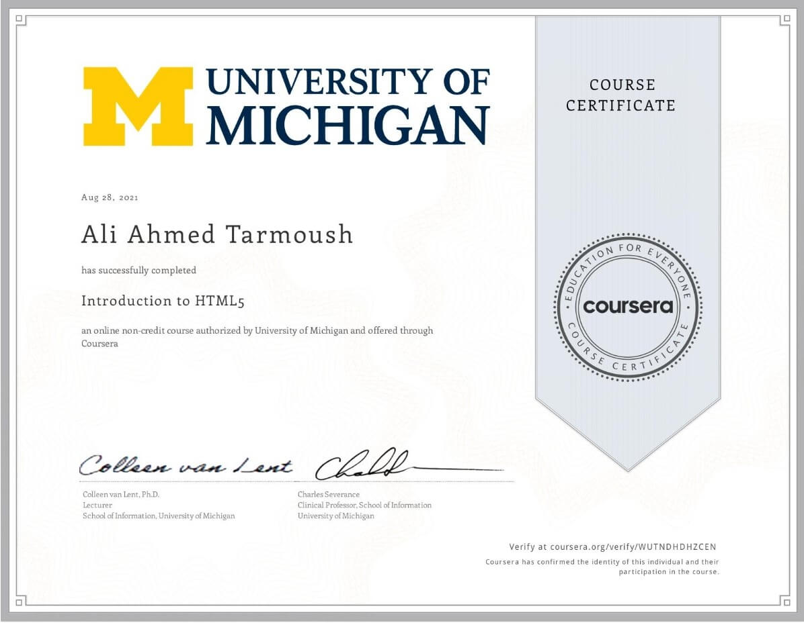
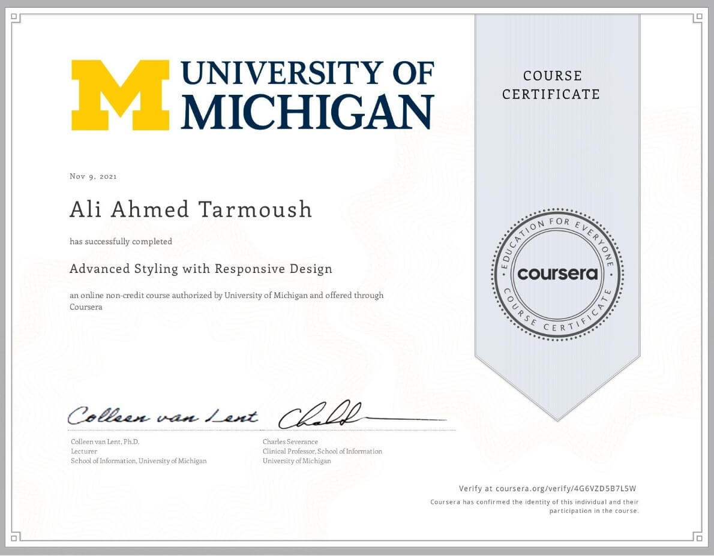
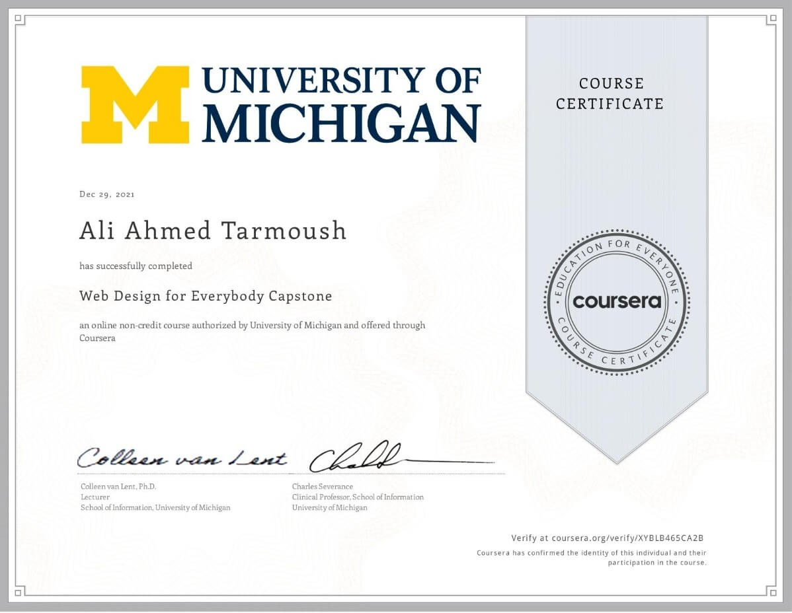

# Web Design for Everybody: Basics of Web Development & Coding

5 COURSE SPECIALIZATION

## Offered by University of Michigan

## Sponsored by Syrian Youth Assembly

# About this Specialization

This Specialization covers how to write syntactically correct HTML5 and CSS3, and how to create interactive web experiences with JavaScript. Mastering this range of technologies will allow you to develop high quality web sites that, work seamlessly on mobile, tablet, and large screen browsers accessible. During the capstone you will develop a professional-quality web portfolio demonstrating your growth as a web developer and your knowledge of accessible web design. This will include your ability to design and implement a responsive site that utilizes tools to create a site that is accessible to a wide audience, including those with visual, audial, physical, and cognitive impairments.

# Courses in this Specialization

## COURSE 1: Introduction to HTML5

 
Thanks to a growing number of software programs, it seems as if anyone can make a webpage. But what if you actually want to understand how the page was created? There are great textbooks and online resources for learning web design, but most of those resources require some background knowledge. This course is designed to help the novice who wants to gain confidence and knowledge. We will explore the theory (what actually happens when you click on a link on a webpage?), the practical (what do I need to know to make my own page?), and the overlooked (I have a page, what do I do now?). Throughout the course there will be a strong emphasis on adhering to syntactic standards for validation and semantic standards to promote wide accessibility for users with disabilities. The textbook we use is available online, “The Missing Link: An Introduction to Web Development and Programming” by Michael Mendez from www.opensuny.org. This course will appeal to a wide variety of people, but specifically those who would like a step-by-step description of the basics. There are no prerequisites for this course and it is assumed that students have no prior programming skills or IT experience. The course will culminate in a small final project that will require the completion of a very simple page with links and images. The focus of this course is on the basics, not appearance. You can see a sample final page at http://intro-webdesign.com/html5-plain.html. This is the first course in the Web Design For Everybody specialization. Subsequent courses focus on the marketable skills of styling the page with CSS3, adding interactivity with JavaScript and enhancing the styling with responsive design. You can see a sample site for the capstone course at http://intro-webdesign.com/
    

## COURSE 2: Introduction to CSS3

 
    The web today is almost unrecognizable from the early days of white pages with lists of blue links. Now, sites are designed with complex layouts, unique fonts, and customized color schemes. This course will show you the basics of Cascading Style Sheets (CSS3). The emphasis will be on learning how to write CSS rules, how to test code, and how to establish good programming habits. When done correctly, the styling of a webpage can take enhance your page. When done incorrectly the result can be worse than no styling at all. To ensure that your sites do not put up barriers for people with cognitive and/or physical disabilities, you will learn how to evaluate pages using the standardized POUR accessibility guidelines. Upon completion of the course, learners will be able to sketch a design for a given HTML page. Using that design they will use CSS to implement the design by adding fonts, colors, and layouts. This is the second course in the Web Design For Everybody specialization. Subsequent courses focus on adding interaction with JavaScript and enhancing the styling with responsive design. It will be difficult to complete this course if you do not have access to a laptop or desktop computer for the homework.

## COURSE 3: Interactivity with JavaScript

 
    If you want to take your website to the next level, the ability to incorporate interactivity is a must. But adding some of these types of capabilities requires a stronger programming language than HTML5 or CSS3, and JavaScript can provide just what you need. With just a basic understanding of the language, you can create a page that will react to common events such as page loads, mouse clicks & movements, and even keyboard input. This course will introduce you to the basics of the JavaScript language. We will cover concepts such as variables, looping, functions, and even a little bit about debugging tools. You will understand how the Document Object Model (DOM) is used by JavaScript to identify and modify specific parts of your page. After the course, learners will be able to react to DOM Events and dynamically alter the contents and style of their page. The class will culminate in a final project - the creation of an interactive HTML5 form that accepts and verifies input. This is the third course in the Web Design For Everybody specialization. A basic understanding of HTML and CSS is expected when you enroll in this class. Additional courses focus on enhancing the styling with responsive design and completing a capstone project.
     

## COURSE 4: Advanced Styling with Responsive Design

 
    It used to be the case that everyone viewed webpages on about the same size screen. But with the explosion of the use of smartphones to access the Internet, the landscape of design has completely changed. People viewing your site will now expect that it will perform regardless of the platform (smartphone, tablet, laptop, or desktop computer). This ability to respond to any platform is called responsive design. This course will expand upon the basic knowledge of CSS3 to include topics such as wireframes, fluid design, media queries, and the use of existing styling paradigms such as Bootstrap. After the course, learners will be able to: ** Explain the mobile-first paradigm and the importance of wireframes in the design phase ** Create sites that behave across a range of platforms ** Utilize existing design frameworks such as Bootstrap This is the fourth course in the Web Design For Everybody specialization. A basic understanding of HTML and CSS is expected when you enroll in this class. Additional courses focus on adding interactivity with the JavaScript Programming Language and completing a capstone project.
     

## COURSE 5: Web Design for Everybody Capstone

    The capstone will develop a professional-quality web portfolio. Students will demonstrate the ability to design and implement a responsive site for a minimum of three platforms. Adherence to validation and accessibility standards will be required. The evolving student implementations will be reviewed each week by capstone peers and teaching assistants to make sure that the student keeps up with the agenda of the course. Upon completion of this course students will feel comfortable creating and/or updating existing front-end sites, utilizing existing frameworks, and testing sites for accessibility compliance. This course is only open to students who have completed the first four courses in the Web Design for Everybody specialization: Introduction to HTML5, Introduction to CSS3, Interactivity with JavaScript, and Advanced Styling with Responsive Design.
     

